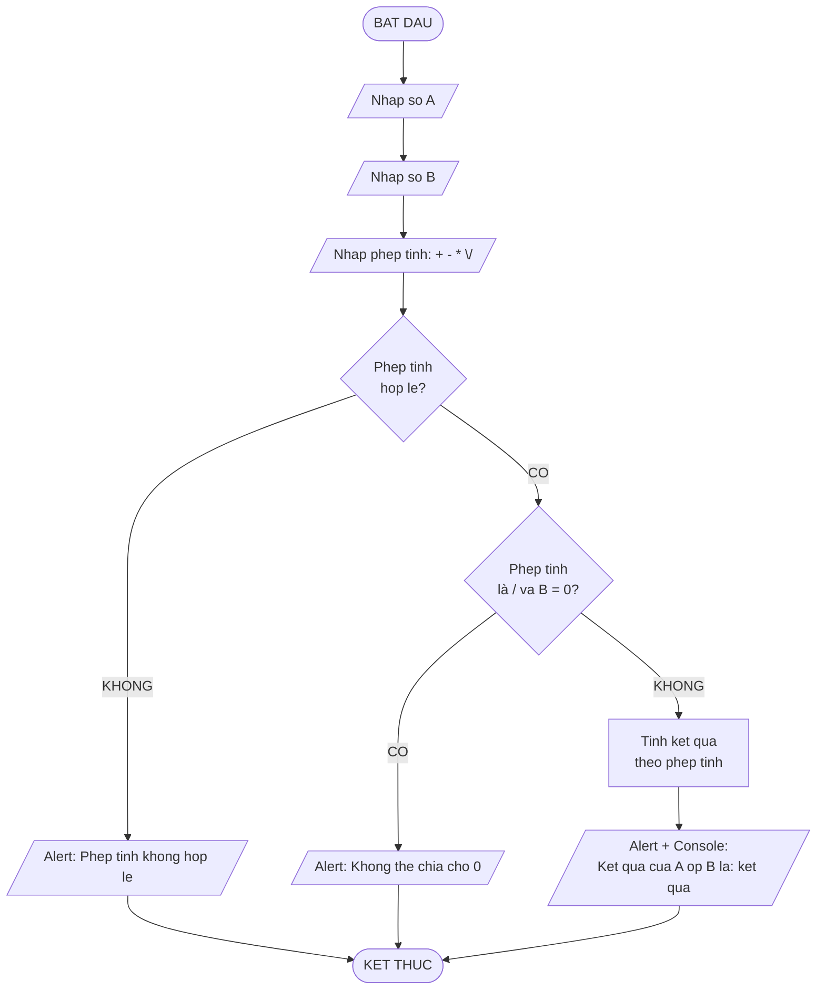

## Flowchart

```mermaid
flowchart TD
    A([BAT DAU]) --> B[/Nhap so A/]
    B --> C[/Nhap so B/]
    C --> D[/Nhap phep tinh: + - * \//]
    D --> E{Phep tinh\nhop le?}

    E -- KHONG --> F[/Alert: Phep tinh khong hop le/]
    F --> K([KET THUC])

    E -- CO --> G{Phep tinh\nlà /  va B = 0?}
    G -- CO --> H[/Alert: Khong the chia cho 0/]
    H --> K

    G -- KHONG --> I[Tinh ket qua\ntheo phep tinh]
    I --> J[/Alert + Console:\nKet qua cua A op B la: ket qua/]
    J --> K
```

