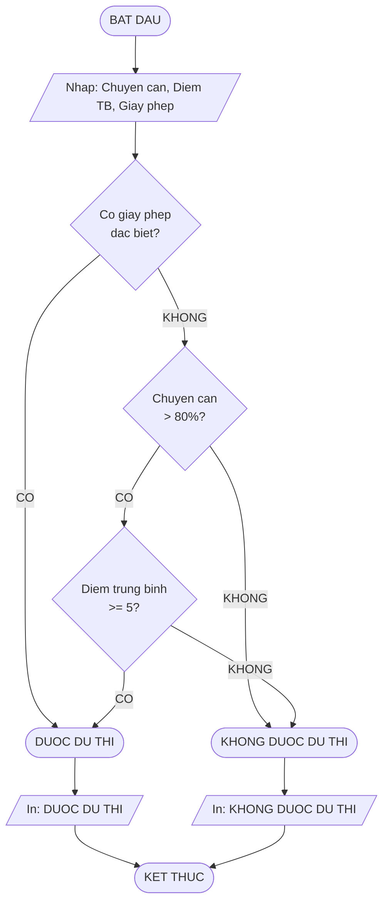

## Flowchart

```mermaid
flowchart TD
    A([BAT DAU]) --> B[/Nhap: Chuyen can, Diem TB, Giay phep/]
    B --> C{Co giay phep\ndac biet?}

    C -- CO --> G([DUOC DU THI])
    C -- KHONG --> D{Chuyen can\n> 80%?}

    D -- KHONG --> H([KHONG DUOC DU THI])
    D -- CO --> E{Diem trung binh\n>= 5?}

    E -- KHONG --> H
    E -- CO --> G

    G --> I[/In: DUOC DU THI/]
    H --> J[/In: KHONG DUOC DU THI/]

    I --> K([KET THUC])
    J --> K
```

