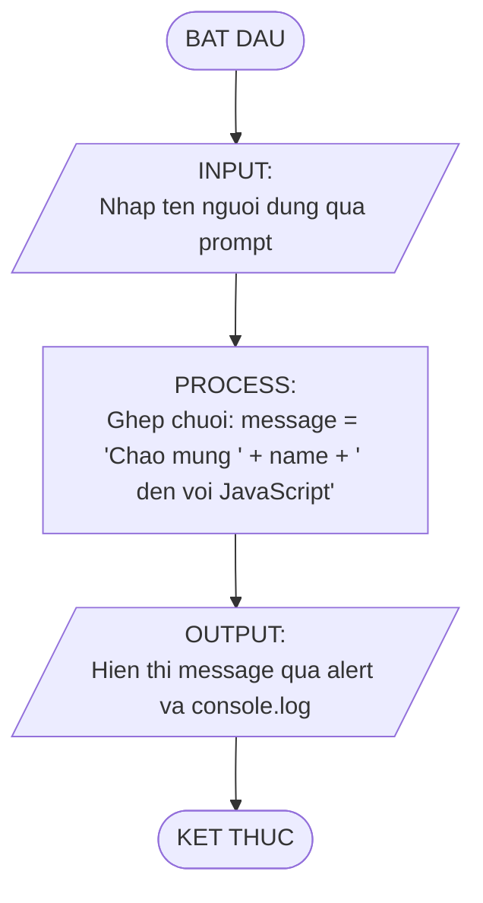

# Flowchart - Bai 1: Flowchart I-P-O va Xuat du lieu

## Flowchart

```mermaid
flowchart TD
    A([BAT DAU]) --> B[/INPUT:\nNhap ten nguoi dung qua prompt/]
    B --> C[PROCESS:\nGhep chuoi: message = 'Chao mung ' + name + ' den voi JavaScript']
    C --> D[/OUTPUT:\nHien thi message qua alert va console.log/]
    D --> E([KET THUC])
```
