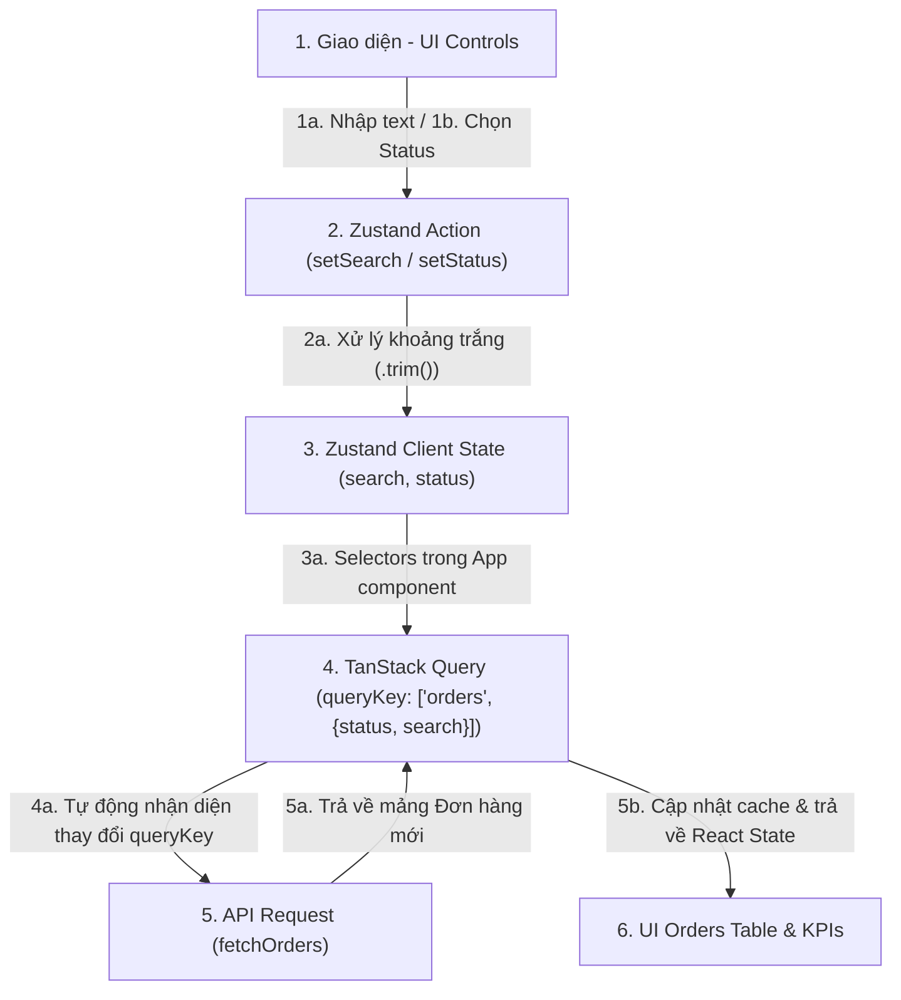

# PHÂN TÍCH LUỒNG TRUYỀN DỮ LIỆU (I/O ANALYSIS)
## Đồng bộ Client State (Zustand) & Server State (TanStack Query)

---

### 1. Sơ đồ Luồng Dữ Liệu (I/O Dataflow)

---

### 2. Chi Tiết Luồng Dữ Liệu (Step-by-Step Flow)

#### Bước 1: UI Controls (Nguồn phát dữ liệu)
* Người dùng tương tác với thanh tìm kiếm (nhập chữ) hoặc bấm các nút chọn trạng thái lọc (Pending, Shipped, Delivered, All).
* Input nhận giá trị trực tiếp và kích hoạt hàm phản hồi (Event Handlers).

#### Bước 2: Zustand Layer (Tầng xử lý Client State & Bẫy khoảng trắng)
* **Xử lý bẫy dữ liệu (Spaces Trap)**: Để đảm bảo người dùng vẫn có thể gõ dấu cách bình thường trong input (không bị xóa dấu cách ngay khi gõ), Zustand lưu trữ hai cơ chế:
  * State `search` lưu trữ chuỗi thô (raw string) phục vụ việc liên kết 2 chiều (two-way binding) với thẻ `<input>`.
  * Bộ giải quyết dữ liệu `getTrimmedSearch()` thực hiện tác vụ lọc khoảng trắng ở đầu và cuối chuỗi (`.trim()`) trước khi dữ liệu rời khỏi tầng Zustand để chuyển sang TanStack Query.
* **Hành động**: `setStatus(status)` và `setSearch(search)` cập nhật Client State nội bộ của Zustand.

#### Bước 3: TanStack Query (Tầng đồng bộ và Fetching tự động)
* `useQuery` đăng ký `queryKey` theo cấu trúc: `['orders', { status, search: trimmedSearch }]`.
* **Cơ chế phản ứng tự động (Không dùng `useEffect`)**:
  * Khi người dùng thay đổi bộ lọc, Zustand State cập nhật $\rightarrow$ Component `App` render lại $\rightarrow$ Giá trị mới của `status` hoặc `trimmedSearch` được nạp vào `queryKey`.
  * TanStack Query thực hiện so sánh nông các phần tử trong `queryKey`. Do key thay đổi, nó sẽ đánh dấu cache cũ là không hợp lệ (stale) và tự động kích hoạt lại hàm fetch `fetchOrders(status, trimmedSearch)`.
  * Cơ chế này chạy ngầm độc lập hoàn toàn thông qua khai báo reactive, tránh được việc lạm dụng `useEffect` dễ gây lỗi vòng lặp render vô tận hoặc không đồng bộ đúng thời điểm.

#### Bước 4: API & UI Table (Đích đến dữ liệu)
* Hàm `fetchOrders` nhận các tham số sạch đã được chuẩn hóa (trimmed), thực hiện gọi API giả lập (delay 500ms).
* Khi dữ liệu trả về, TanStack Query lưu vào bộ nhớ cache, đồng thời cấp phát dữ liệu sạch xuống `orders` state của component.
* Bảng danh sách và các thẻ thống kê KPI tự động cập nhật số liệu mới mà không bị gián đoạn.
