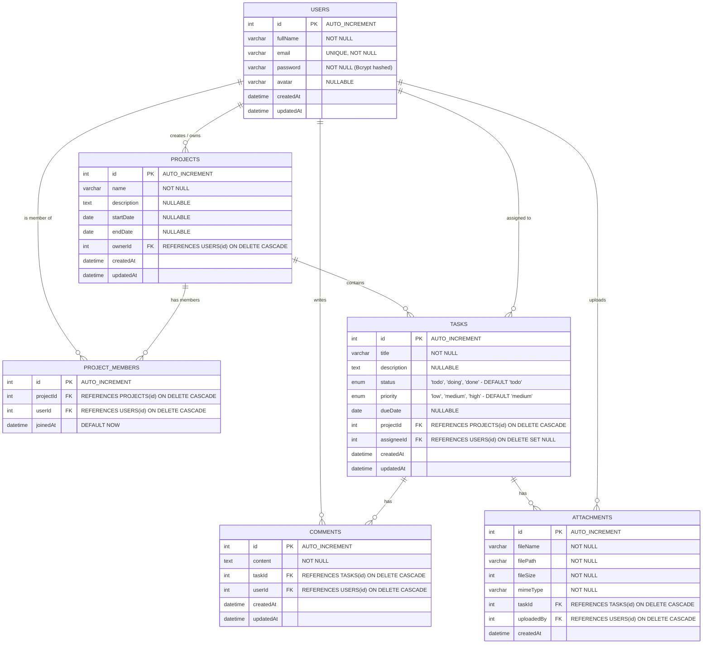

# THIẾT KẾ CƠ SỞ DỮ LIỆU (DATABASE DESIGN & ERD)
## Dự án: Task Management Web App

---

## 1. Sơ đồ thực thể kết hợp (ERD - Entity Relationship Diagram)

---

## 2. Chi tiết các Bảng & Ràng Buộc

### 2.1. Bảng `users` (Người dùng)
| Tên cột | Kiểu dữ liệu | Ràng buộc | Mô tả |
| :--- | :--- | :--- | :--- |
| `id` | INT | PRIMARY KEY, AUTO_INCREMENT | Mã định danh người dùng |
| `fullName` | VARCHAR(100) | NOT NULL | Họ và tên |
| `email` | VARCHAR(150) | NOT NULL, UNIQUE | Địa chỉ email đăng nhập |
| `password` | VARCHAR(255) | NOT NULL | Mật khẩu đã băm (Bcrypt) |
| `avatar` | VARCHAR(255) | NULLABLE | Link ảnh đại diện |
| `createdAt` | DATETIME | NOT NULL | Thời điểm tạo tài khoản |
| `updatedAt` | DATETIME | NOT NULL | Thời điểm cập nhật gần nhất |

### 2.2. Bảng `projects` (Dự án)
| Tên cột | Kiểu dữ liệu | Ràng buộc | Mô tả |
| :--- | :--- | :--- | :--- |
| `id` | INT | PRIMARY KEY, AUTO_INCREMENT | Mã định danh dự án |
| `name` | VARCHAR(150) | NOT NULL | Tên dự án |
| `description` | TEXT | NULLABLE | Mô tả chi tiết dự án |
| `startDate` | DATE | NULLABLE | Ngày bắt đầu dự án |
| `endDate` | DATE | NULLABLE | Ngày dự kiến hoàn thành |
| `ownerId` | INT | NOT NULL, FK -> `users(id)` | Chủ sở hữu dự án (`ON DELETE CASCADE`) |
| `createdAt` | DATETIME | NOT NULL | Thời điểm tạo |
| `updatedAt` | DATETIME | NOT NULL | Thời điểm cập nhật |

### 2.3. Bảng `project_members` (Thành viên tham gia dự án - N-N)
| Tên cột | Kiểu dữ liệu | Ràng buộc | Mô tả |
| :--- | :--- | :--- | :--- |
| `id` | INT | PRIMARY KEY, AUTO_INCREMENT | Mã định danh bản ghi |
| `projectId` | INT | NOT NULL, FK -> `projects(id)` | Mã dự án (`ON DELETE CASCADE`) |
| `userId` | INT | NOT NULL, FK -> `users(id)` | Mã thành viên (`ON DELETE CASCADE`) |
| `joinedAt` | DATETIME | DEFAULT CURRENT_TIMESTAMP | Ngày tham gia |
*(Đảm bảo cặp `[projectId, userId]` là `UNIQUE` để tránh trùng lặp thành viên).*

### 2.4. Bảng `tasks` (Công việc)
| Tên cột | Kiểu dữ liệu | Ràng buộc | Mô tả |
| :--- | :--- | :--- | :--- |
| `id` | INT | PRIMARY KEY, AUTO_INCREMENT | Mã định danh công việc |
| `title` | VARCHAR(255) | NOT NULL | Tiêu đề công việc |
| `description` | TEXT | NULLABLE | Mô tả chi tiết công việc |
| `status` | ENUM | `'todo', 'doing', 'done'` DEFAULT `'todo'` | Trạng thái công việc |
| `priority` | ENUM | `'low', 'medium', 'high'` DEFAULT `'medium'` | Mức độ ưu tiên |
| `dueDate` | DATE | NULLABLE | Hạn chót hoàn thành |
| `projectId` | INT | NOT NULL, FK -> `projects(id)` | Thuộc dự án nào (`ON DELETE CASCADE`) |
| `assigneeId` | INT | NULLABLE, FK -> `users(id)` | Người được giao việc (`ON DELETE SET NULL`) |
| `createdAt` | DATETIME | NOT NULL | Thời điểm tạo |
| `updatedAt` | DATETIME | NOT NULL | Thời điểm cập nhật |

---

## 3. Ràng buộc toàn vẹn & Hành vi Cascade
1. **Xóa Dự án (`projects`):**
   - Khi xóa một dự án: Toàn bộ bản ghi thành viên trong `project_members`, các `tasks`, `comments` và `attachments` liên quan sẽ tự động bị xóa sạch (`ON DELETE CASCADE`), đảm bảo không có dữ liệu mồ côi.
2. **Xóa Tài khoản (`users`):**
   - Nếu User là `assigneeId` trong một Task: chuyển thành `NULL` (`ON DELETE SET NULL`) để task vẫn còn trong dự án.
   - Nếu User bị xóa: bản ghi trong `project_members` tự động xóa theo.
